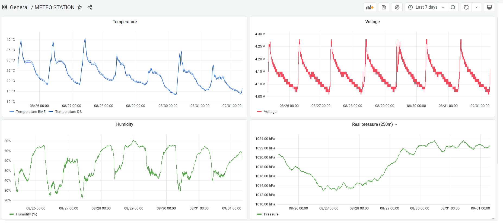

# METEO STATION – ESP32 code

### ◾ About the project

**Meteo station** is my small after-hours project that contains of **three** repositories:
- Meteo station code (this repo)
- [Meteo station PCB based on ESP32 ](https://github.com/alicjamusial/meteo-station-pcb)
- [Meteo station 3D prints](https://github.com/alicjamusial/meteo-station-3d-print)

As the name suggest, is a DIY self-sufficient weather measuring device. I decided to design it as a PCB board with goldpins to stick-in or stick-out individual components and sensors (ESP32, BME280 etc.) to make it more reusable. It could have - of course - been integrated on board, but it would be more expensive and time-consuming to create.

The code was written using **Arduino IDE**. It was meant to be quick and clear, not the best.

> **Warning**  
> This is a hobbyist project, so I take no responsibility for any possible issues you may encounter :)

I was inspired by solution created by [this guy on Instructables](https://www.instructables.com/Solar-Powered-WiFi-Weather-Station-V30/). He did a good job, so I strongly recommand exploring his meteo projects!

### ◾ How to run this code?
1. Install Arduino IDE.
2. Add ESP32 board to Arduino IDE [as it is described e.g. here](https://randomnerdtutorials.com/installing-the-esp32-board-in-arduino-ide-windows-instructions/).
3. Install needed libraries - `OneWire`, `BH1750`, `Adafruit_BME280`, `DallasTemperature` etc.
4. Copy `data-example.h` and rename it to `data.h`. Uncomment all lines and fill it with your values:
   - SSID - your WiFi name,
   - Password = your WiFi password,
   - Influx =  fill `[IP_ADDRESS]` and `[DB-NAME]` fields with your Influx instance data (see next paragraph "Server setup").
5. Check if your ESP32 connects to WiFi and sends data to Influx properly. If you set `IsDebug` to `True` you will see additional debugging logs via UART.

### ◾ Server setup

1. Install Influx on the Raspberry Pi or other computer that you use as a local server. This code works with Influx v. 1.8.
2. Set up Influx to be always running on port 8086 (or change the port in the `data.h`').
3. Create a database for the data.
4. That's all 😊 The ESP32 should connect to it (after filling up `data.h`) and send all the information to the created database. I recommend Grafana to preview all charts real-time.

### ◾ Adjust it to your needs!
This is an absolutely hobbyst project :) You can use it as a reference to create something a lot better.

### ◾ License
Meteo Station project is available on Creative Commons Attribution Share Alike 4.0 International license (more in [license file](LICENSE.txt)). You are free to use it, modify it and produce as many of your own boards as you need.

### ◾ Final result

Cable tie and tape for the win ;)

  

